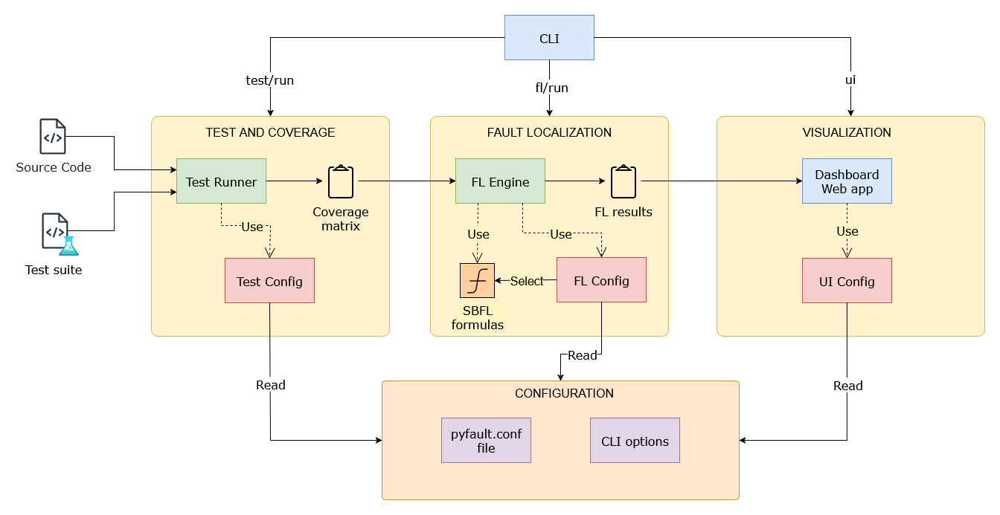

# PyFault: Spectrum-Based Fault Localization for Python

PyFault is a comprehensive Python framework for automated fault localization using Spectrum-Based Fault Localization (SBFL) techniques. It provides a complete pipeline from test execution with coverage collection to interactive visualization of fault localization results.

## Table of Contents

- [Overview](#overview)
- [Architecture](#architecture)
- [Features](#features)
- [Installation](#installation)
- [Quick Start](#quick-start)
- [CLI Usage](#cli-usage)
- [Web Dashboard](#web-dashboard)
- [Configuration](#configuration)
- [Supported SBFL Formulas](#supported-sbfl-formulas)
- [Project Structure](#project-structure)
- [API Reference](#api-reference)
- [Development](#development)
- [Contributing](#contributing)
- [License](#license)

## Overview

PyFault automates the process of fault localization by:

1. **Test Execution**: Running test suites with comprehensive coverage collection
2. **Coverage Analysis**: Analyzing which code lines are executed by passing vs failing tests
3. **Suspiciousness Calculation**: Applying SBFL formulas to rank code elements by fault suspiciousness
4. **Interactive Visualization**: Providing rich web-based dashboards for exploring results

The framework supports multiple SBFL formulas and provides both command-line tools and a web-based dashboard for result analysis.

## Architecture

PyFault follows a modular architecture with clear separation of concerns:



### Core Components

1. **Test Runner**: Executes tests using pytest with coverage.py integration
2. **FL Engine**: Calculates suspiciousness scores using various SBFL formulas
3. **Dashboard**: Interactive web interface for result visualization
4. **Configuration System**: Flexible configuration management
5. **SBFL Formulas**: Extensible formula implementations

## Features

### Core Functionality
- ✅ **Automated Test Execution**: Integration with pytest for seamless test running
- ✅ **Coverage Collection**: Line and branch coverage with test context information
- ✅ **Multiple SBFL Formulas**: Support for 10+ industry-standard formulas
- ✅ **Comprehensive Reporting**: JSON-based reports with detailed metadata
- ✅ **Interactive Dashboard**: Rich web-based visualization interface

### CLI Features
- ✅ **Modular Commands**: Separate commands for testing, fault localization, and visualization
- ✅ **Flexible Configuration**: File-based and command-line configuration options
- ✅ **Pipeline Integration**: Single command for complete workflow execution
- ✅ **Rich Output**: Colored terminal output with progress indicators
- ✅ **Error Handling**: Comprehensive error reporting and debugging support

### Dashboard Features
- ✅ **Multiple Visualizations**: Treemaps, sunburst charts, coverage matrices
- ✅ **Source Code Integration**: Syntax-highlighted code with suspiciousness overlay
- ✅ **Interactive Filtering**: Dynamic threshold adjustment and formula comparison
- ✅ **Export Capabilities**: Download results and visualizations
- ✅ **Responsive Design**: Works on desktop and mobile devices

## Installation

### Basic Installation

```bash
pip install pyfault
```

### Development Installation

```bash
git clone https://github.com/example/pyfault.git
cd pyfault
pip install -e \".[dev]\"
```

### With UI Dependencies

```bash
pip install \"pyfault[ui]\"
# or for development
pip install -e \".[dev,ui]\"
```

### Requirements

- Python 3.9+
- pytest
- coverage.py
- numpy
- rich
- click

Additional UI dependencies:
- streamlit
- plotly
- pandas

## Quick Start

### 1. Basic Fault Localization

```bash
# Navigate to your Python project
cd my_python_project

# Run complete fault localization pipeline
pyfault run --source-dir src --test-dir tests

# View results in interactive dashboard
pyfault ui --report report.json
```

### 2. Step-by-Step Workflow

```bash
# Step 1: Run tests with coverage
pyfault test --source-dir src --test-dir tests --output coverage.json

# Step 2: Calculate fault localization scores
pyfault fl --input coverage.json --output report.json --formulas ochiai tarantula dstar2

# Step 3: Launch dashboard
pyfault ui --report report.json --port 8501
```

### 3. Using Configuration Files

Create a `pyfault.conf` file:

```ini
[test]
source_dir = src
test_dir = tests
output_file = coverage.json
ignore = */__init__.py
omit = */__init__.py

[fl]
input_file = coverage.json
output_file = report.json
formulas = ochiai, tarantula, jaccard, dstar2
```

Then run:

```bash
pyfault run --config pyfault.conf
```

## CLI Usage

PyFault provides a comprehensive command-line interface with four main commands:

### `pyfault test`

Runs tests with coverage collection.

```bash
pyfault test [OPTIONS]

Options:
  -s, --source-dir PATH     Source code directory (default: .)
  -t, --test-dir PATH       Test directory (auto-detected if not specified)
  -o, --output PATH         Output coverage file (default: coverage.json)
  -k, --test-filter TEXT    Filter tests using pytest -k pattern
  --ignore PATTERN          File patterns to ignore (multiple allowed)
  --omit PATTERN            File patterns to omit from coverage (multiple allowed)
  -c, --config PATH         Configuration file (default: pyfault.conf)
  -v, --verbose             Enable verbose output
  --help                    Show help message
```

**Example:**
```bash
pyfault test -s src -t tests -o my_coverage.json -k \"not slow\"
```

### `pyfault fl`

Calculates fault localization suspiciousness scores.

```bash
pyfault fl [OPTIONS]

Options:
  -i, --input PATH          Input coverage file (default: coverage.json)
  -o, --output PATH         Output report file (default: report.json)
  -f, --formulas FORMULA    SBFL formulas to use (multiple allowed)
  -c, --config PATH         Configuration file (default: pyfault.conf)
  -v, --verbose             Enable verbose output
  --help                    Show help message
```

**Example:**
```bash
pyfault fl -i coverage.json -o results.json -f ochiai -f tarantula -f dstar2
```

### `pyfault run`

Executes the complete fault localization pipeline.

```bash
pyfault run [OPTIONS]

Options:
  -s, --source-dir PATH     Source code directory (default: .)
  -t, --test-dir PATH       Test directory (auto-detected if not specified)
  -o, --output PATH         Output report file (default: report.json)
  -k, --test-filter TEXT    Filter tests using pytest -k pattern
  --ignore PATTERN          File patterns to ignore (multiple allowed)
  --omit PATTERN            File patterns to omit from coverage (multiple allowed)
  -f, --formulas FORMULA    SBFL formulas to use (multiple allowed)
  -c, --config PATH         Configuration file (default: pyfault.conf)
  -v, --verbose             Enable verbose output
  --help                    Show help message
```

**Example:**
```bash
pyfault run -s src -t tests -o final_report.json -f ochiai -f dstar2 --ignore \"*/migrations/*\"
```

### `pyfault ui`

Launches the interactive web dashboard.

```bash
pyfault ui [OPTIONS]

Options:
  -r, --report PATH         Report file to visualize (default: report.json)
  -p, --port INTEGER        Port for the dashboard (default: 8501)
  --no-open                 Don't auto-open browser
  -v, --verbose             Enable verbose output
  --help                    Show help message
```

**Example:**
```bash
pyfault ui -r my_report.json -p 8080 --no-open
```

## Web Dashboard

The PyFault dashboard provides an interactive web interface for exploring fault localization results. Built with Streamlit and Plotly, it offers multiple visualization modes and analysis tools.

### Dashboard Features

#### 1. **Overview Page**
- Project summary and statistics
- Test execution results
- Formula comparison overview
- Quick navigation to detailed views

#### 2. **Treemap Visualization**
- Hierarchical view of project structure
- Color-coded suspiciousness levels
- Interactive drill-down capabilities
- Configurable size and color metrics

#### 3. **Sunburst Chart**
- Circular hierarchical visualization
- Multi-level project exploration
- Dynamic filtering and zooming
- Suspiciousness distribution analysis

#### 4. **Coverage Matrix**
- Test-to-code coverage visualization
- Pass/fail test indicators
- Interactive coverage exploration
- Export capabilities

#### 5. **Source Code Viewer**
- Syntax-highlighted source code
- Suspiciousness score overlays
- Line-by-line analysis
- Multiple formula comparison

#### 6. **Advanced Analytics**
- Statistical analysis of suspiciousness scores
- Formula effectiveness comparison
- Threshold-based filtering
- Custom metric calculations

### Navigation and Usage

The dashboard uses a sidebar navigation system with the following sections:

1. **File Selection**: Load reports from file system
2. **Visualization Type**: Choose between different chart types
3. **Formula Selection**: Select SBFL formulas to analyze
4. **Filtering Options**: Apply thresholds and filters
5. **Display Settings**: Customize visualization parameters

### Interactive Features

- **Dynamic Filtering**: Adjust suspiciousness thresholds in real-time
- **Multi-Formula Comparison**: View results from multiple formulas simultaneously
- **Export Functions**: Download visualizations and data
- **Responsive Design**: Optimized for desktop and mobile viewing
- **Keyboard Shortcuts**: Quick navigation and actions

## Configuration

PyFault supports flexible configuration through configuration files and command-line arguments.

### Configuration File Format

PyFault uses INI-style configuration files with two main sections:

```ini
[test]
# Test execution configuration
source_dir = src                    # Source code directory
test_dir = tests                    # Test directory (optional)
output_file = coverage.json         # Coverage output file
ignore = */__init__.py             # Patterns to ignore for test discovery
omit = */__init__.py               # Patterns to omit from coverage

[fl]
# Fault localization configuration
input_file = coverage.json          # Input coverage file
output_file = report.json           # Output report file
formulas = ochiai, tarantula, jaccard, dstar2  # SBFL formulas to use
```

### Configuration Precedence

Configuration values are resolved in the following order (highest to lowest priority):

1. Command-line arguments
2. Configuration file values
3. Default values

### Environment Variables

PyFault supports the following environment variables:

- `PYFAULT_CONFIG`: Default configuration file path
- `PYFAULT_VERBOSE`: Enable verbose output (set to \"1\" or \"true\")
- `PYFAULT_NO_COLOR`: Disable colored output (set to \"1\" or \"true\")

## Supported SBFL Formulas

PyFault implements 10+ industry-standard SBFL formulas:

### Core Formulas

| Formula | Description | Reference |
|---------|-------------|-----------|
| **Ochiai** | Most effective general-purpose formula | Ochiai (1957) |
| **Tarantula** | Classic fault localization formula | Jones & Harrold (2005) |
| **Jaccard** | Set similarity-based formula | Jaccard (1912) |
| **D-Star** | Optimized binary formula (D*, D**, D***) | Wong et al. (2014) |

### Additional Formulas

| Formula | Description | Use Case |
|---------|-------------|----------|
| **Kulczynski2** | Symmetric similarity measure | Balanced precision/recall |
| **Naish1** | Binary classification formula | Clear fault/no-fault distinction |
| **Russell-Rao** | Simple ratio-based formula | Baseline comparisons |
| **Sorensen-Dice** | Harmonic mean of precision/recall | F1-score equivalent |
| **SBI** | Similarity-based index | Specialized applications |

### Formula Selection Guidelines

- **Ochiai**: Best general-purpose choice, effective across different scenarios
- **Tarantula**: Good baseline, widely studied and compared
- **D-Star**: Excellent for projects with many passing tests
- **Jaccard**: Simple and interpretable, good for initial analysis

### Custom Formulas

PyFault supports custom formula implementation through the `SBFLFormula` base class:

```python
from pyfault.formulas.base import SBFLFormula

class CustomFormula(SBFLFormula):
    def calculate(self, n_cf: int, n_nf: int, n_cp: int, n_np: int) -> float:
        # Implement your formula logic
        return custom_calculation(n_cf, n_nf, n_cp, n_np)
```

## Project Structure

```
root/
├── pyfault/                        # Main package
│   ├── __init__.py                 # Package initialization
│   ├── core/                       # Core components
│   │   ├── cli/                    # Command-line interface
│   │   │   ├── __init__.py
│   │   │   └── main.py             # CLI entry points
│   │   ├── test/                   # Test execution components
│   │   │   ├── __init__.py
│   │   │   ├── config.py           # Test configuration
│   │   │   └── runner.py           # pytest integration
│   │   ├── fl/                     # Fault localization engine
│   │   │   ├── __init__.py
│   │   │   ├── config.py           # FL configuration
│   │   │   ├── data.py             # Coverage data structures
│   │   │   └── engine.py           # FL calculation engine
│   │   └── formulas/               # SBFL formula implementations
│   │       ├── __init__.py
│   │       ├── base.py             # Abstract base class
│   │       └── sbfl_formulas.py    # Formula implementations
│   └── ui/                         # Web dashboard
│       ├── __init__.py
│       └── dashboard.py            # Streamlit dashboard
├── tests/                          # Test suite
│   ├── test_cli.py                 # CLI tests
│   ├── test_e2e.py                 # End-to-end tests
│   ├── test_fl.py                  # FL engine tests
│   ├── test_formulas.py            # Formula tests
│   └── ...                         # Additional test files
├── examples/                       # Example projects
│   └── ex1/                        # Sample project
│       ├── pyfault.conf            # Example configuration
│       ├── src/                    # Example source code
│       └── tests/                  # Example tests
├── pyproject.toml                  # Project configuration
├── pytest.ini                      # pytest configuration
├── LICENSE                         # MIT license
└── README.md                       # This file
```

## API Reference

### Core Classes

#### `TestRunner`
Executes tests with coverage collection.

```python
from pyfault.test import TestRunner, TestConfig

config = TestConfig(source_dir="src", test_dir="tests")
runner = TestRunner(config)
result = runner.run_tests()
```

#### `FLEngine`
Calculates fault localization scores.

```python
from pyfault.fl import FLEngine, FLConfig

config = FLConfig(formulas=["ochiai", "tarantula"])
engine = FLEngine(config)
engine.calculate_suspiciousness("coverage.json", "report.json")
```

#### `SBFLFormula`
Base class for implementing custom formulas.

```python
from pyfault.formulas.base import SBFLFormula

class MyFormula(SBFLFormula):
    def calculate(self, n_cf, n_nf, n_cp, n_np):
        # Your implementation
        return score
```

### Configuration Classes

#### `TestConfig`
Configuration for test execution.

```python
from pyfault.test.config import TestConfig

config = TestConfig(
    source_dir="src",
    test_dir="tests",
    output_file="coverage.json",
    ignore_patterns=["*/__init__.py"],
    omit_patterns=["*/test_*"]
)
```

#### `FLConfig`
Configuration for fault localization.

```python
from pyfault.fl.config import FLConfig

config = FLConfig(
    input_file="coverage.json",
    output_file="report.json",
    formulas=["ochiai", "tarantula", "dstar2"]
)
```

### Dashboard Integration

```python
from pyfault.ui.dashboard import launch_dashboard

launch_dashboard(
    report_file="report.json",
    port=8501,
    auto_open=True
)
```

```python
from pyfault.ui.dashboard import launch_dashboard

launch_dashboard(
    report_file="report.json",
    port=8501,
    auto_open=True
)
```

## Development

### Setting Up Development Environment

```bash
# Clone the repository
git clone https://github.com/example/pyfault.git
cd pyfault

# Create virtual environment
python -m venv venv
source venv/bin/activate  # On Windows: venv\\Scripts\\activate

# Install in development mode
pip install -e ".[dev,ui]"

# Install pre-commit hooks
pre-commit install
```

### Running Tests

```bash
# Run all tests
python -m pytest tests/ -v

# Run with coverage
python -m pytest tests/ --cov=src/pyfault --cov-report=html

# Run specific test categories
python -m pytest tests/test_formulas.py -v
python -m pytest tests/test_e2e.py -v
```

### Code Quality

```bash
# Type checking
mypy src/pyfault

# Code formatting
black src/ tests/

# Linting
flake8 src/ tests/
```

### Adding New SBFL Formulas

1. Implement the formula in `src/pyfault/formulas/sbfl_formulas.py`
2. Add it to the `AVAILABLE_FORMULAS` dict in `src/pyfault/fl/engine.py`
3. Export it from `src/pyfault/formulas/__init__.py`
4. Add tests in `tests/test_formulas.py`

### Contributing

1. Fork the repository
2. Create a feature branch (`git checkout -b feature/amazing-feature`)
3. Make your changes
4. Add tests for new functionality
5. Ensure all tests pass
6. Commit your changes (`git commit -m 'Add amazing feature'`)
7. Push to the branch (`git push origin feature/amazing-feature`)
8. Open a Pull Request

## License

This project is licensed under the MIT License - see the [LICENSE](LICENSE) file for details.

## Acknowledgments

- Built on top of excellent Python tools: pytest, coverage.py, streamlit, plotly
- Inspired by fault localization research and tools like GZoltar
- SBFL formulas based on academic literature and industry best practices

---

For more information, visit our [documentation](https://github.com/example/pyfault) or open an [issue](https://github.com/example/pyfault/issues).
