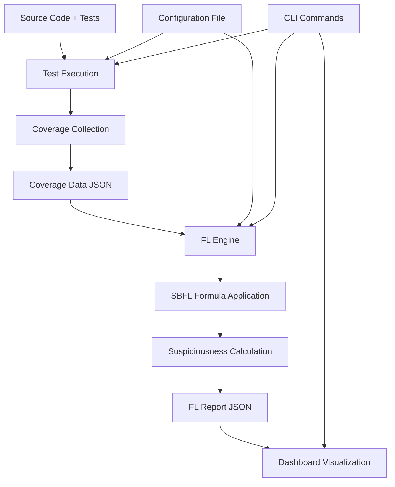

# PyFault Architecture Documentation

This document provides a comprehensive overview of the PyFault architecture, including its core components, data flow, and design principles.

## 🏗️ System Architecture

PyFault follows a modular architecture designed for extensibility, maintainability, and separation of concerns. The system is organized into distinct layers and components that work together to provide comprehensive fault localization capabilities.

```
┌─────────────────────────────────────────────────────────────┐
│                     User Interface Layer                    │
├─────────────────────────────────────────────────────────────┤
│  CLI Interface          │        Web Dashboard             │
│  (pyfault.cli)         │        (pyfault.ui)              │
├─────────────────────────────────────────────────────────────┤
│                    Application Layer                        │
├─────────────────────────────────────────────────────────────┤
│  Test Runner           │    FL Engine                      │
│  (pyfault.test)        │    (pyfault.fl)                   │
├─────────────────────────────────────────────────────────────┤
│                     Formula Layer                           │
├─────────────────────────────────────────────────────────────┤
│               SBFL Formula Implementations                   │
│                  (pyfault.formulas)                         │
├─────────────────────────────────────────────────────────────┤
│                      Data Layer                             │
├─────────────────────────────────────────────────────────────┤
│  Configuration  │  Coverage Data  │  FL Results             │
│     (.conf)     │   (.json)       │   (.json)               │
└─────────────────────────────────────────────────────────────┘
```

## 📦 Core Components

### 1. Test Runner Module (`pyfault.test`)

The test runner module is responsible for executing tests and collecting detailed coverage information.

#### Key Components:
- **`TestRunner`**: Main class for test execution orchestration
- **`TestConfig`**: Configuration management for test execution
- **Coverage Collection**: Integration with `coverage.py` for detailed tracing

#### Responsibilities:
- Execute tests using pytest
- Collect line-by-line coverage data
- Track test outcomes (passed/failed/skipped)
- Generate coverage matrices linking tests to code lines
- Produce structured coverage reports

#### Data Flow:
```
Source Code + Tests → TestRunner → Coverage Data → JSON Report
```

### 2. Fault Localization Engine (`pyfault.fl`)

The FL engine processes coverage data and applies SBFL formulas to calculate suspiciousness scores.

#### Key Components:
- **`FLEngine`**: Main fault localization orchestrator
- **`FLConfig`**: Configuration management for FL processing
- **`FLData`**: Data structures for coverage and suspiciousness information

#### Responsibilities:
- Parse coverage data from test execution
- Apply SBFL formulas to calculate suspiciousness scores
- Generate comprehensive fault localization reports
- Provide metadata and statistics about the analysis

#### Data Flow:
```
Coverage Data → FLEngine → SBFL Formulas → Suspiciousness Scores → FL Report
```

### 3. SBFL Formulas Module (`pyfault.formulas`)

This module implements various Spectrum-Based Fault Localization formulas.

#### Key Components:
- **`SBFLFormula`**: Abstract base class for all formulas
- **Concrete Implementations**: Ochiai, Tarantula, Jaccard, D*
- **Utility Functions**: Safe mathematical operations and helpers

#### Formula Interface:
```python
class SBFLFormula:
    def calculate(self, n_cf: int, n_nf: int, n_cp: int, n_np: int) -> float:
        """Calculate suspiciousness score based on coverage statistics."""
        pass
```

#### Available Formulas:

##### Ochiai Formula
```python
def calculate(self, n_cf, n_nf, n_cp, n_np):
    return n_cf / sqrt((n_cf + n_nf) * (n_cf + n_cp))
```

##### Tarantula Formula
```python
def calculate(self, n_cf, n_nf, n_cp, n_np):
    failed_ratio = n_cf / (n_cf + n_nf)
    passed_ratio = n_cp / (n_cp + n_np)
    return failed_ratio / (failed_ratio + passed_ratio)
```

##### Jaccard Formula
```python
def calculate(self, n_cf, n_nf, n_cp, n_np):
    return n_cf / (n_cf + n_nf + n_cp)
```

##### D* Formula
```python
def calculate(self, n_cf, n_nf, n_cp, n_np):
    return (n_cf ** self.star) / (n_cp + n_nf)
```

### 4. Command Line Interface (`pyfault.cli`)

The CLI provides a comprehensive command-line interface for all PyFault operations.

#### Commands Structure:
```
pyfault
├── test     # Test execution with coverage
├── fl       # Fault localization calculation
├── run      # Complete pipeline execution
└── ui       # Dashboard launch
```

#### Design Principles:
- **Composability**: Commands can be used independently or in sequence
- **Configuration**: Support for both file-based and command-line configuration
- **Error Handling**: Comprehensive error reporting and debugging support
- **Rich Output**: Enhanced terminal output using the Rich library

### 5. User Interface Module (`pyfault.ui`)

The UI module provides interactive web-based visualization and analysis tools.

#### Key Features:
- **Multi-Tab Interface**: Organized views for different analysis aspects
- **Interactive Visualizations**: Treemaps, sunburst charts, coverage matrices
- **Source Code Viewer**: Syntax-highlighted code with suspiciousness overlay
- **Formula Comparison**: Side-by-side analysis of different SBFL formulas
- **Export Capabilities**: Generate reports and download analysis results

#### Dashboard Tabs:
1. **Overview**: Summary metrics and key insights
2. **Source Code**: Interactive code browser with highlighting
3. **Test-to-Fault Analysis**: Coverage matrix visualization
4. **Treemap**: Hierarchical project structure view
5. **Sunburst**: Circular hierarchy representation
6. **Formula Comparison**: Comparative analysis of SBFL formulas
7. **Formula Performance**: Effectiveness metrics and benchmarking

## 🔄 Data Flow Architecture

### Complete Pipeline Flow



### Data Structures

#### Coverage Data Structure
```json
{
  "meta": {
    "version": "coverage.py version",
    "timestamp": "ISO datetime",
    "command_line": "coverage command used"
  },
  "files": {
    "path/to/file.py": {
      "executed_lines": [1, 2, 5, 7],
      "summary": {
        "covered_lines": 4,
        "num_statements": 10,
        "percent_covered": 40.0
      },
      "contexts": {
        "test_name": [1, 2],
        "other_test": [5, 7]
      }
    }
  },
  "totals": {
    "covered_lines": 4,
    "num_statements": 10,
    "percent_covered": 40.0
  }
}
```

#### FL Report Structure
```json
{
  "meta": {
    "timestamp": "ISO datetime",
    "pyfault_version": "0.1.0",
    "formulas_used": ["ochiai", "tarantula"],
    "source_files_analyzed": 15
  },
  "totals": {
    "test_statistics": {
      "total_tests": 42,
      "passed_tests": 38,
      "failed_tests": 4,
      "skipped_tests": 0
    },
    "analysis_statistics": {
      "files_analyzed": 15,
      "total_lines_with_scores": 245,
      "formulas_calculated": 4
    },
    "sbfl_formulas": ["ochiai", "tarantula", "jaccard", "dstar2"]
  },
  "files": {
    "path/to/file.py": {
      "suspiciousness": {
        "ochiai": {
          "1": 0.857,
          "2": 0.654,
          "5": 0.123
        },
        "tarantula": {
          "1": 0.923,
          "2": 0.786,
          "5": 0.234
        }
      },
      "coverage_data": {
        "line_coverage": [1, 2, 5, 7],
        "test_contexts": {...}
      }
    }
  }
}
```

## 🔧 Configuration Architecture

### Configuration Hierarchy

PyFault supports a flexible configuration system with multiple sources:

1. **Default Values**: Hard-coded sensible defaults
2. **Configuration Files**: INI-style files (pyfault.conf)
3. **Command Line Arguments**: Runtime overrides
4. **Environment Variables**: System-level configuration

### Configuration Flow
```
Default Values → Config File → CLI Arguments → Final Configuration
```

### Configuration Classes

#### TestConfig
```python
@dataclass
class TestConfig:
    source_dir: str = "."
    test_dir: Optional[str] = None
    output_file: str = "coverage.json"
    ignore_patterns: Optional[List[str]] = None
    omit_patterns: Optional[List[str]] = None
```

#### FLConfig
```python
@dataclass
class FLConfig:
    input_file: str = "coverage.json"
    output_file: str = "report.json"
    formulas: Optional[List[str]] = None
```

## 🎯 Design Principles

### 1. Separation of Concerns
- Each module has a single, well-defined responsibility
- Clear interfaces between components
- Minimal coupling between modules

### 2. Extensibility
- Plugin-like architecture for SBFL formulas
- Abstract base classes for easy extension
- Configuration-driven behavior

### 3. Data-Driven Processing
- Structured data formats (JSON) for interoperability
- Clear data transformation pipelines
- Comprehensive metadata tracking

### 4. Error Handling
- Graceful degradation on errors
- Comprehensive error messages
- Debugging support through verbose modes

### 5. Performance
- Efficient data structures for large codebases
- Lazy loading and caching where appropriate
- Minimal memory footprint

## 🔌 Extension Points

### Adding New SBFL Formulas

1. Inherit from `SBFLFormula` base class
2. Implement the `calculate` method
3. Register the formula in the formula registry

```python
class NewFormula(SBFLFormula):
    def calculate(self, n_cf, n_nf, n_cp, n_np):
        # Custom formula implementation
        return result
```

### Adding New Visualizations

1. Create new tab in the dashboard
2. Implement visualization using Plotly/Streamlit
3. Add to the main dashboard interface

### Custom Output Formats

1. Extend the FL engine with new export methods
2. Implement custom serialization logic
3. Add CLI options for new formats

## 🧪 Testing Architecture

### Test Organization
```
tests/
├── test_cli.py              # CLI interface tests
├── test_fl.py               # Fault localization tests
├── test_formulas.py         # Formula implementation tests
├── test_ui_cli.py          # UI command tests
├── test_e2e.py             # End-to-end integration tests
└── test_performance.py     # Performance benchmarks
```

### Test Categories
- **Unit Tests**: Individual component testing
- **Integration Tests**: Component interaction testing
- **End-to-End Tests**: Complete pipeline testing
- **Performance Tests**: Scalability and efficiency testing

## 📊 Performance Considerations

### Scalability Factors
- Number of source files
- Lines of code per file
- Number of tests
- Test execution time
- Memory usage for large coverage matrices

### Optimization Strategies
- Incremental processing for large codebases
- Streaming data processing for memory efficiency
- Parallel formula calculation
- Caching of intermediate results

## 🔄 Future Architecture Enhancements

### Planned Improvements
1. **Distributed Processing**: Support for large-scale analysis
2. **Real-time Analysis**: Live fault localization during development
3. **ML Integration**: Machine learning-enhanced suspiciousness calculation
4. **IDE Plugins**: Direct integration with popular development environments
5. **API Server**: REST API for programmatic access

### Extension Opportunities
1. **Multi-language Support**: Extend beyond Python
2. **Advanced Visualizations**: 3D representations and VR interfaces
3. **Collaborative Features**: Team-based fault localization workflows
4. **Historical Analysis**: Trend analysis over time

This architecture documentation provides the foundation for understanding, maintaining, and extending the PyFault system. The modular design ensures that the system can evolve and adapt to new requirements while maintaining stability and performance.
